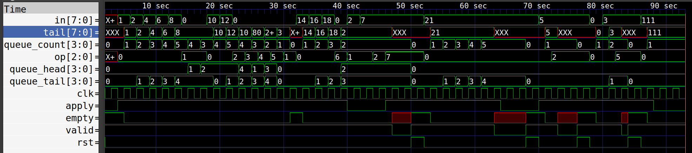

# Task_2

## Калькулятор над очередью

## Используемая терминология

*Очередью* в задании называется упорядоченная конечная последовательность чисел, для которой используются следующая терминология.

*Голова* очереди — это первый элемент последовательности, *хвост* последний элемент.

*Добавить* число *n* в очередь = добавить *n* в конец последовательности. *Извлечь* число из очереди = удалить первый элемент последовательности.

Размером очереди называется общее число содержащихся в ней элементов (длина последовательности). Очередь *пуста*, если её размер 0, и *непуста* в остальных случаях.

В задании рассматривается очередь, допустимый размер которой ограничен сверху заранее заданным числом *ёмкостью* этой очереди.

## Порты

**Входы:**

- ***clk***, ширина 1: тактовый.
- ***rst***, ширина 1: асинхронный сброс.
- ***in***, ширина 8: входное число.
- ***op***, ширина 3: код операции.
- ***apply***, ширина 1: флаг применения операции. Выходы:
- ***tail***, ширина 8: хвост очереди.
- ***empty***, ширина 1: индикатор пустоты очереди.
- ***valid***, ширина 1: индикатор корректности очереди.

## Описание схемы

В схеме содержится очередь ёмкости 5. Чи́сла в этой очереди имеют ширину 8.

После асинхронного сброса очередь пуста. Содержимое очереди изменяется в моменты положительных фронтов тактового сигнала следующим образом. Если **apply == 0**, то очередь не изменяется. Если **apply == 1**, то очередь изменяется согласно коду операции (значению **op**):

- 0: в очередь добавляется число **in**.
- 1: из очереди извлекается число.
- 2: из очереди извлекается два числа, и в очередь добавляется сумма этих чисел (*в этом и следующих пунктах — извлечение и добавление происходит единовременно*).
- 3: из очереди извлекается два числа, и в очередь добавляется произведение этих чисел.
- 4: из очереди извлекается два числа, и в очередь добавляется разность второго и первого извлечённых чисел.
- 5: из очереди извлекается два числа, и в очередь добавляется частное от деления второго извлечённого числа на первое.
- 6: из очереди извлекается два числа, и в очередь добавляется остаток от деления второго извлечённого числа на первое.

Операция *некорректна*, если верно хотя бы одно из следующих условий:

- Код операции отличается от всех перечисленных выше.
- В очереди не содержится столько чисел, сколько должно быть извлечено.
- В очередь должно быть добавлено число, и при этом её размер равен ёмкости.
- При выполнении операции происходит деление на ноль.

После асинхронного сброса **valid == 1**, и это значение не изменяется, пока не будет применена некорректная операция. После применения некорректной операции значение **valid** немедленно становится равным **0** и больше не изменяется, а значения в остальных выходах не специфицированы (*правильность решения не зависит от этих значений*).

Пока **valid == 1**:

- В выход **tail** выводится текущий хвост очереди (*если очередь пуста, то что угодно*).
- Значение на выходе **empty** — **1**, если очередь пуста, и **0**, если очередь непуста.

## Пример симуляции 
Заупуск с помощью **Makefile** : `make all`

