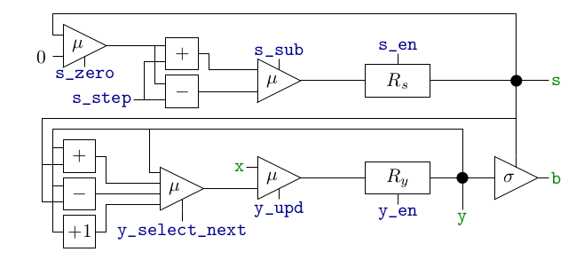
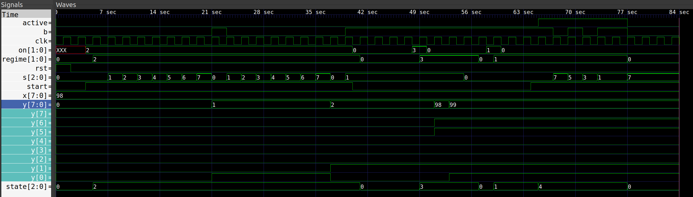

# Task_4
Требуется дополнить операционный автомат, изображённый ниже (в приложенном коде  экземпляр модуля ***datapath*** в ***main.v*** ), подсхемами для распознавания свойств данных и управляющим автоматом, представляющим собой типовую реализацию символьного автомата, так чтобы в целом получилась син- хронная схема с асинхронным сбросом, устроенная как написано ниже.

## Операционный автомат

**В этом операционном автомате:**

- Все прямоугольники и треугольники — это подсхемы, в которых выход расположен справа, а входы остальных сторон.
- **Зелёным** цветом раскрашены информационные точки, а **синим** цветом — управляющие.
- 0 — это схема, выдающая 0 во всех разрядах (константа 0). 
- μ — это мультиплексор, информационные входы которого расположены слева и нумеруются сверху вниз с ноля.
- σ — это мультиплексор, информационными входами которого являются разряды шины, располага- ющейся слева.
- \+ \— это схема сложения чисел.
- \- — это схема вычитания числа на нижнем входе из числа на верхнем входе.
- +1 — это схема прибавления единицы к числу.
- $R_s$ — это параллельный регистр ширины 3 с асинхронным сбросом и включением (вход включения расположен сверху), выход которого непрерывно направляется в s.
- $R_y$ — это параллельный регистр ширины 8 с асинхронным сбросом и включением (вход включения расположен снизу), выход которого непрерывно направляется в y.

**Ширина именованных точек:**

- **s_en**: 1.
- **s_step**: 2.
- **s_sub**: 1.
- **s_zero**: 1.
- **y_en**: 1.
- **y_select_next** : 2.
- **y_upd**: 1.
- **b**: 1.
- **s**: 3.
- **x**: 8.
- **y**: 8.

## Порты

**Входы:**

- **x**: ширина 8, информационный, направляется в одноимённый вход операционного автомата.
- **on**: ширина 2, управляющий.
- **start**: ширина 1, управляющий.
- **clk**, **rst**: тактовый и асинхронный сброс соответственно.

**Выходы:**

- **y**: ширина 8, информационный, направляется из одноимённого выхода операционного автомата.
- **s**: ширина 3, информационный, направляется из одноимённого выхода операционного автомата.
- **b**: ширина 1, информационный, направляется из одноимённого выхода операционного автомата.
- **regime**: ширина 2, управляющий.
- **active**: ширина 1, управляющий.

## Поведение схемы

Схема может находиться в одном из четырёх режимов: выключена (0), перечисляет (1), считает (2), обновляет (3). Текущий режим всегда выводится в выход **regime**. После сброса схема выключена. По умолчанию (если не сказано иное) выходные значения не изменяются при переходе к следующему такту.

### Поведение выключенной схемы.
В **active** выдаётся 0. При чтении значения **on(t)** схема немедленно переходит в соответствующий режим.

### Поведение перечисляющей схемы. 
Схема может быть активной (1) или неактивной (0), и текущее значение активности всегда выводится в выход **active**.

В начале перечисления схема неактивна, и остаётся неактивной, пока не будет прочитано значение **start(t) = 1**. После чтения этого значения схема активируется (становится активной), и до смены режима остаётся активной.

Если схема неактивна, то значение **s** не изменяется. Если схема активна, то:

- Значение **s** изменяется так, чтобы в выход **b** последовательно были выданы все нечётные разряды значения **y** по убыванию номеров ( **y[7]** , **y[5]** , **y[3]** , **y[1]** ), причём значение **y[1]** должно выдаваться два такта, а остальные  по одному такту.
- По завершении выдачи разрядов из предыдущего пункта схема выключается со значением **s = 7**.

### Поведение считающей схемы.
В **active** выдаётся 0. Если читается значение **start(t) = 0**, то схема выключается, а иначе (при каждом чтении **start(t) = 1**):

- Значение **s** увеличивается на 1 (*здесь и дальше  с переполнением*).
- Если при увеличении **s** происходит переполнение, то в тот же момент **y** увеличивается на 1.

### Поведение обновляющей схемы. 
В **active** выдаётся 0. После перехода в этот режим по следующим четырём передним фронтам **clk** последовательно выполняются следующие действия:

- В **y** присваивается значение **x**.
- К **y** прибавляется значение **s**.
- Из **s** вычитается единица.
- Схема выключается.

## Пример симуляции 
Заупуск с помощью **Makefile** : `make all`

